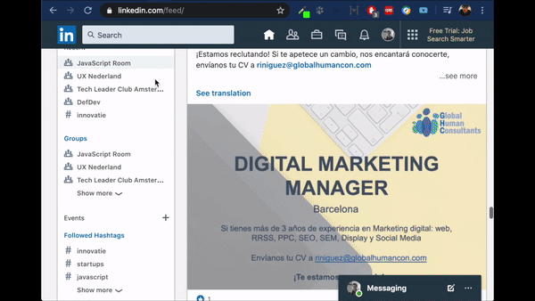

# linkedin-video-downloader

Google Chrome extension for downloading videos from LinkedIn.

It's available on [Chrome Web Store](https://chrome.google.com/webstore/detail/linkedin-video-downloader/jphfcmjmlcoecehbanbbfgonpapcnjdi)

## Preview

## Development

1. Install dependencies with `npm ci`
2. Create `.env` configuration file based on `.env.example`
3. Make a build with `npm run dist` command
4. Install the extenstion using development mode from the `./dist` folder directly

## Production

Production build and deployment are done automatically via CI (GitHub Actions)

## Contribution

If you spotted any issue or have an idea how to improve the extension feel free to open an issue.

## Support project

